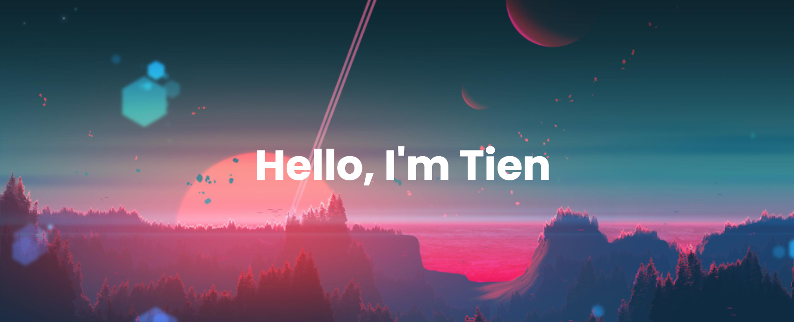

  Currently, I'm a senior studying at Ton Duc Thang University, pursuing a Bachelor degree in Computer Science. I am passionate in learning. Aspired to contribute.

  

<h2 align="center">Technology Stack</h2>

  
  
  
  
  
  
  

<h2 align="center">
  My Github Stats
</h2>
 
 

  
  

<!-- 

 

  -->

<!-- 

 

 
 -->
<h2 align="center">Contact</h2>

  

